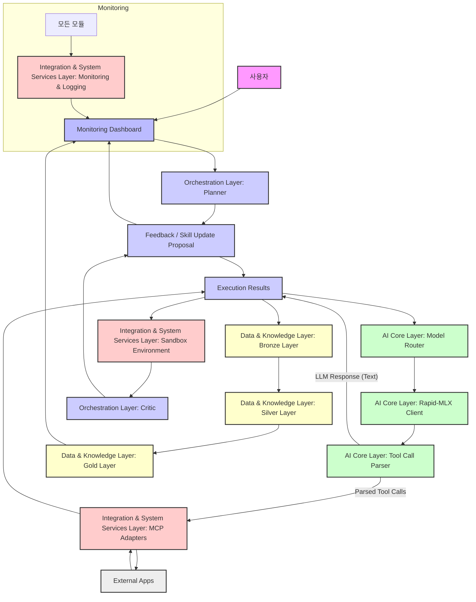

# AIOS 모듈러 아키텍처 설계 (v1.0)

## 1. 개요

AIOS는 고도로 모듈화된 아키텍처를 통해 유연성, 확장성, 유지보수성을 확보합니다. 각 모듈은 명확한 책임을 가지며, 정의된 인터페이스를 통해 상호작용합니다. 이는 Rapid-MLX의 고성능 추론, AI-BI 프레임워크의 데이터 관리, 그리고 Perplexity가 제안한 안정성 강화 전략을 유기적으로 통합합니다.

## 2. 아키텍처 레이어 및 핵심 모듈

AIOS 아키텍처는 크게 5개의 레이어로 구성되며, 각 레이어는 여러 핵심 모듈을 포함합니다.

### 2.1. UI & Presentation Layer
사용자에게 AIOS의 상태, 워크플로우 진행 상황, 분석 결과 등을 시각적으로 제공하고 사용자 입력을 처리합니다.

*   **AIOS Command Center (apps/web)**:
    *   **역할**: 사용자 인터페이스 (Next.js 기반), 실시간 워크플로우 시각화, 통합 대시보드, 채팅 인터페이스.
    *   **주요 기능**: 에이전트 상태 모니터링, Rapid-MLX 엔진 상태 표시, 연결 앱 지표 위젯, 사용자 명령 입력.

### 2.2. Orchestration Layer (AIOS Core Engine)
AIOS의 두뇌 역할을 하며, 사용자 명령을 해석하고, 워크플로우를 계획하며, 에이전트 간의 협업을 조정합니다. 사용자님이 가장 핵심적인 코어 엔진으로 지목하신 부분입니다.

*   **Planner (packages/orchestrator)**:
    *   **역할**: 사용자 명령을 받아 `SKILL.md`를 참조하여 실행 계획(`TODO.md`)을 생성.
    *   **주요 기능**: 목표 분석, 스킬 탐색, 실행 계획 수립, 컨텍스트 관리.
*   **Executor (packages/orchestrator)**:
    *   **역할**: Planner가 생성한 `TODO.md`에 따라 실제 작업을 순차적으로 실행.
    *   **주요 기능**: 스킬 호출, 외부 앱 연동, 작업 진행 상황 업데이트, 중간 결과 기록.
*   **Critic (packages/orchestrator)**:
    *   **역할**: Executor의 작업 결과 및 Planner의 계획을 평가하고, 개선 피드백 제공.
    *   **주요 기능**: 작업 성공 여부 판단, `SKILL.md` 개선 제안, 자가 성찰(Self-Reflection) 로직 수행.
*   **Workflow Manager (packages/orchestrator)**:
    *   **역할**: LangGraph.js 기반으로 에이전트 간의 상태 전이 및 워크플로우 흐름 제어.
    *   **주요 기능**: 3단계 스킬 승인 루프 관리, 롤백/보상 작업 트리거, 작업 스냅샷 관리.

### 2.3. AI Core Layer
AIOS의 지능을 담당하는 핵심 엔진으로, LLM 추론 및 도구 호출을 관리합니다.

*   **Rapid-MLX Client (packages/ai-core)**:
    *   **역할**: Rapid-MLX 서버와의 통신 인터페이스 제공.
    *   **주요 기능**: Chat Completion, 모델 목록 조회, 헬스 체크.
*   **Model Router (packages/ai-core)**:
    *   **역할**: 작업 유형(채팅, 코딩, 추론 등)에 따라 최적의 로컬 LLM 모델을 선택하여 라우팅.
    *   **주요 기능**: M5 Pro 24GB 환경에 최적화된 모델 매핑, 동적 모델 선택.
*   **Tool Call Parser (packages/ai-core)**:
    *   **역할**: LLM이 생성한 도구 호출(Tool Call)을 파싱하고, 깨진 형식을 자동으로 복구.
    *   **주요 기능**: JSON/XML/YAML 등 다양한 형식 지원, 오류 보정, 정규화.

### 2.4. Data & Knowledge Layer (Medallion Architecture)
AIOS의 모든 데이터와 지식을 체계적으로 관리하고, AI-BI 프레임워크를 통해 비즈니스 통찰을 제공합니다.

*   **Bronze Layer (packages/data-ingestion)**:
    *   **역할**: 3개 앱 및 외부 소스에서 원시 데이터 수집 및 저장.
    *   **주요 기능**: n8n 기반 데이터 인제스천, PostgreSQL (JSONB) 원시 데이터 저장, Undo Log 및 스냅샷 관리.
*   **Silver Layer (packages/data-processing)**:
    *   **역할**: Bronze 데이터 정제, 구조화, AI 기반 분석 및 특징 추출.
    *   **주요 기능**: Flowise 기반 AI 오케스트레이션, Rapid-MLX를 활용한 데이터 강화, PostgreSQL (관계형) 구조화된 데이터 저장.
*   **Gold Layer (packages/knowledge-bi)**:
    *   **역할**: 비즈니스 통찰 제공, 지식 베이스 구축 및 관리, KPI 모니터링.
    *   **주요 기능**: OpenKB 기반 Wiki 지식 DB, Metabase/Appsmith 기반 BI 대시보드, Knowledge Lint (지식 품질 검증).

### 2.5. Integration & System Services Layer
외부 시스템과의 연동 및 AIOS 운영에 필요한 공통 서비스를 제공합니다.

*   **MCP Adapters (packages/mcp-adapters)**:
    *   **역할**: 3개 연결 앱(vibe-coding-os, ai-automation-work-portal, project-revenue-ops-os)과의 표준화된 통신 인터페이스 제공.
    *   **주요 기능**: API 호출, Webhook/Event Stream 처리, 보상 작업(Compensation) 로직 구현.
*   **Sandbox Environment (packages/sandbox)**:
    *   **역할**: AI가 생성한 코드 모듈 및 스킬 개선 제안을 안전하게 테스트하고 검증하는 격리 환경.
    *   **주요 기능**: 코드 실행, 테스트 자동화, 보안 검증.
*   **Monitoring & Logging (packages/monitoring)**:
    *   **역할**: AIOS 전체 시스템의 상태, 성능, 에러를 실시간으로 모니터링하고 기록.
    *   **주요 기능**: 에이전트 활동 로깅, Rapid-MLX 성능 지표 수집, 경고 시스템.

## 3. 모듈 간 인터페이스 및 데이터 흐름

AIOS의 모듈 간 데이터 흐름은 다음과 같은 주요 상호작용을 통해 이루어집니다.

**주요 데이터 흐름:**

1.  **사용자 명령**: 사용자가 UI를 통해 명령을 입력하면, UI & Presentation Layer는 이를 Orchestration Layer의 Planner로 전달합니다.
2.  **계획 수립 및 실행**: Planner는 사용자 의도를 분석하여 `TODO.md` 형태의 실행 계획을 수립하고 Workflow Manager를 통해 Executor에게 전달합니다. Executor는 이 계획에 따라 AI Core Layer를 활용하여 LLM 추론을 수행하고, Tool Call Parser를 통해 외부 앱(External Apps)과 상호작용합니다.
3.  **데이터 수집 및 처리**: Executor의 작업 결과 및 외부 앱의 데이터는 Data & Knowledge Layer의 Bronze Layer로 유입됩니다. 이후 Silver Layer에서 AI 기반으로 정제 및 구조화되고, Gold Layer에서 비즈니스 통찰 및 지식 베이스로 변환되어 UI에 표시됩니다.
4.  **검증 및 학습**: Executor가 생성한 코드나 스킬은 Sandbox Environment에서 테스트되고, 그 결과는 Critic에게 전달됩니다. Critic은 Workflow Manager를 통해 `SKILL.md` 개선 제안이나 피드백을 제공하며, 이는 UI를 통해 사용자 승인을 거쳐 반영됩니다.
5.  **모니터링**: 모든 모듈의 활동은 Monitoring & Logging Layer에 기록되며, UI의 대시보드를 통해 실시간으로 모니터링됩니다.

## 4. 모듈 간 인터페이스 정의 (예시)

### 4.1. UI & Presentation Layer ↔ Orchestration Layer
*   **Input**: `UserCommand` (string)
*   **Output**: `WorkflowStatus` (JSON), `AgentThoughtProcess` (string), `ApprovalRequest` (JSON)

### 4.2. Orchestration Layer ↔ AI Core Layer
*   **Input**: `LLMRequest` (TaskType, messages, tools)
*   **Output**: `LLMResponse` (content, tool_calls, reasoning_content)

### 4.3. Orchestration Layer ↔ Data & Knowledge Layer
*   **Input**: `RawData` (JSON), `UndoLogEntry` (JSON), `SnapshotData` (JSON), `SkillSuggestion` (JSON)
*   **Output**: `BIReport` (JSON), `WikiContent` (Markdown), `KnowledgeLintReport` (JSON)

### 4.4. Orchestration Layer ↔ Integration & System Services Layer
*   **Input**: `MCPCall` (tool_name, args), `SandboxCode` (string), `LogEntry` (JSON)
*   **Output**: `MCPResponse` (JSON), `SandboxTestResult` (JSON), `SystemMetrics` (JSON)

---

**작성일**: 2026년 5월 25일  
**버전**: v1.0 (Modular Architecture Design)  
**작성자**: Manus AI (with User Insights)
